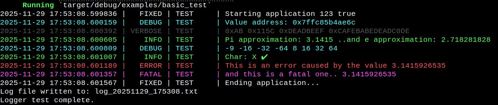
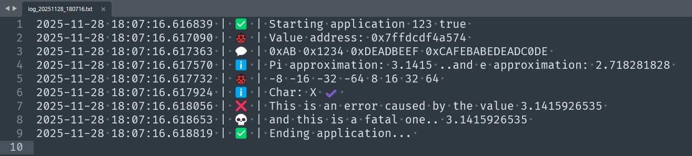
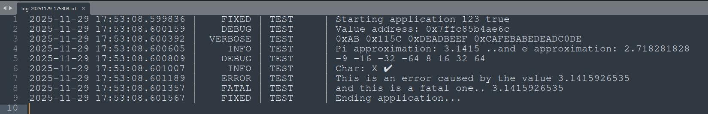

# uRustLogger

`uRustLogger` is a lightweight, flexible, and fully-featured logging library for Rust, designed for both console and file output. It supports multiple log levels, colored console output, file logging with optional icons, per-module tagging, and a rich set of macros for all common data types. The library is ideal for applications that need structured logging with minimal setup.

## Features

- **Multiple log levels**:
  `Verbose`, `Debug`, `Info`, `Warning`, `Error`, `Fatal`, `Fixed`

- **Console output with colors**:
  Each log level can be shown in a distinct color for easy readability.

- **File logging**:
  Logs can be written to a timestamped file. Optionally, each log level can include Unicode emoji icons instead of plain text.

- **Module support**:
  Each log message can include a module tag to indicate the source of the log. Use the macro `log_module!("MODULE_NAME");` at the top of your Rust file to set the module name for all subsequent logs from that file.  
  **Note:** Module names are limited to 8 characters to ensure proper alignment in log output.

- **Configurable formatting**:
  - Include/exclude timestamps
  - Enable/disable console colors
  - Use icons or plain text in log files
  - Include module tags in log output

- **Rich macro-based API**:
  - `log_print!` – log multiple values at once
  - Type-specific macros for all Rust primitive types:
    - Strings: `log_str!`
    - Integers: `log_i8!`, `log_i16!`, `log_i32!`, `log_i64!`
    - Unsigned: `log_u8!`, `log_u16!`, `log_u32!`, `log_u64!`
    - Floats: `log_f32!`, `log_f64!`
    - Booleans: `log_bool!`
    - Characters: `log_char!`
    - Hex: `log_hex8!`, `log_hex16!`, `log_hex32!`, `log_hex64!`
    - Pointers: `log_ptr!`

- **Global thread-safe logger** using `Arc<Mutex<Logger>>`

- **Initialization macros**:
  `log_init!` to configure the logger and `log_deinit!` to safely shut it down.

- **Per-file module tagging**:
  Use `log_module!("MODULE_NAME");` to assign a module name for all log statements in a file. This module name will appear in both console and file output next to the log level, making it easier to trace the origin of messages.  
  **Note:** Only the first 8 characters of the module name are used for alignment.

## Quick Setup

```rust
use logger::*;

#[allow(clippy::approx_constant)]
fn main() {
    
    log_module!("TEST");

    // Initialize the logger:
    // console threshold = Verbose
    // file threshold = Verbose
    // enable file logging = true
    // enable colors = true
    // include date = true
    // use icons in file = true
    log_init!(
        LogLevel::Verbose, // console threshold
        LogLevel::Verbose, // file threshold
        true,              // enable file logging
        true,              // enable colors
        true,              // include date
        false              // use icons in file
    );

    // --- Basic string, integer, bool ---
    log_print!(
        LogLevel::Fixed,
        log_str!("Starting application"),
        log_i32!(123),
        log_bool!(true)
    );

    // --- Pointer logging ---
    let value = 999;
    log_print!(
        LogLevel::Debug,
        log_str!("Value address:"),
        log_ptr!(&value)
    );

    // --- Hex logging ---
    log_print!(
        LogLevel::Verbose,
        log_hex8!(0xABu8),
        log_hex16!(4444u16),
        log_hex32!(0xDEADBEEFu32),
        log_hex64!(0xCAFEBABEDEADC0DEu64)
    );

    // --- Floating point ---
    log_print!(
        LogLevel::Info,
        log_str!("Pi approximation:"),
        log_f32!(3.1415),
        log_str!("..and e approximation:"),
        log_f64!(2.718281828)
    );

    // --- All integer types ---
    let i8val = -9;
    log_print!(
        LogLevel::Debug,
        log_i8!(i8val),
        log_i16!(-16),
        log_i32!(-32),
        log_i64!(-64),
        log_u8!(8),
        log_u16!(16),
        log_u32!(32),
        log_u64!(64)
    );

    // --- Char logging ---
    log_print!(
        LogLevel::Info,
        log_str!("Char:"),
        log_char!('X'),
        log_char!('✔')
    );

    // --- Error example ---
    log_print!(
        LogLevel::Error,
        log_str!("This is an error caused by the value"),
        log_f64!(3.1415926535)
    );

    log_print!(
        LogLevel::Fatal,
        log_str!("and this is a fatal one.."),
        log_f64!(3.1415926535)
    );

    log_print!(LogLevel::Fixed, log_str!("Ending application..."));

    // --- Show file location ---
    {
        let logger = LOGGER.lock().unwrap();
        if let Some(path) = &logger.log_file_path {
            println!("Log file written to: {}", path);
        }
    }

    // Shut down logging
    log_deinit!();

    println!("Logger test complete.");
}

```
## Testing

Run `cargo run --example basic_test`

## Screenshot console output


## Screenshot file output (with icons)


## Screenshot file output (plain text)


